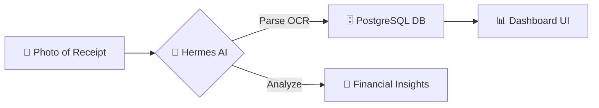

# 💸 Smart Expense — AI-Powered Financial Auditor


**Smart Expense** is an autonomous financial auditing system designed to simplify expense tracking. No more manual data entry — just snap a photo of your receipt (struk), and let AI handle the rest.

---

## ✨ Key Features

- 📸 **AI Receipt Scanning**: Instantly extract merchant, date, items, and totals from any receipt (Indomaret, Alfamart, restaurants, etc.) using LLM Vision.
- 🤖 **AI Financial Advisor**: Receive personalized insights and nagging advice on your spending habits.
- 📊 **Interactive Dashboard**: View your spending patterns with beautiful charts, categories, and filters.
- 🗄️ **Secure Database**: Powered by PostgreSQL with full CRUD capabilities and transaction history.
- 🔗 **Clawser/Hermes Integration**: Seamlessly integrated into the Clawser ecosystem as a specialized skill.

---

## 🚀 How It Works

It's as simple as **Snap, Sync, and Save.**



---

## 🛠️ Getting Started

### Prerequisites
- **Docker** & **Docker Compose**
- **Go 1.22+** (for local backend dev)
- **Node.js 20+** (for local frontend dev)

### Quick Start (Docker)
1. Clone the repository.
2. Run the services:
   ```bash
   docker compose up --build
   ```
3. Access the Dashboard at `http://localhost:5173`.
4. Access the API at `http://localhost:8080`.

---

## 📱 Usage Guide: The "Receipt" Workflow

The primary way to interact with Smart Expense is by sending photos of your receipts.

1. **Snap a Photo**: Take a clear picture of your shopping receipt or restaurant bill.
2. **Send to Agent**: If using via Telegram or a Hermes-enabled agent, simply upload the image.
3. **AI Processing**: The system uses `parse_receipt_hermes_llm.py` to extract:
   - Merchant name (e.g., *Indomaret*)
   - Total amount
   - Itemized list
   - Date and time
4. **Verification**: Check your dashboard at `http://localhost:5173` to see the transaction automatically added and categorized.

---

## 🏗️ Technical Architecture

- **Backend**: Go (Chi, Pgx, JWT)
- **Frontend**: React + Vite + Vanilla CSS
- **Database**: PostgreSQL 17
- **AI Core**: Gemini 1.5 Flash / Claude 3.5 Sonnet (via Sumopod Proxy)
- **Skills**: Python-based automation for receipt parsing and financial analysis.

---

## 📂 Project Structure

```bash
smart-expense/
├── backend/          # Go REST API
├── frontend/         # React Dashboard
├── skills/           # AI Skills & Scripts (OCR, Advisor)
├── migrations/       # SQL Database Migrations
├── docs/             # Documentation & Assets
└── docker-compose.yml
```

---

## 🤝 Contributing
Contributions are welcome! Feel free to open issues or submit pull requests.

---

## 📄 License
This project is licensed under the MIT License.
